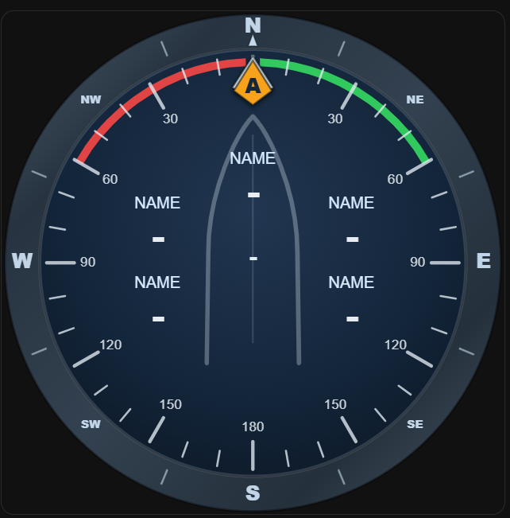

# Marine Nav Compass Card

Built by sailors, for sailors.

A professional NMEA-driven marine navigation instrument for Home Assistant, designed for real-world onboard use.

Created to fill a gap that did not exist in Home Assistant dashboards or existing HACS marine cards.

Tested underway, at anchor, and during live race management.

---

## Features

* Rotating heading compass bezel
* True wind marker
* Apparent wind marker
* Tide/current vector
* Waypoint bearing marker
* Fully configurable data boxes
* Smooth animated transitions
* Embedded SVG graphics
* NMEA 0183 / NMEA 2000 / Signal K compatible

---

## Installation

Install via HACS:

HACS → Custom repositories

Repository:

`https://github.com/OpenMarineSystems/marine-nav-compass-card`

Category:

`Dashboard`

---

## Basic Lovelace Example

```yaml id="y1f3ps"
type: custom:marine-nav-compass-card

heading_entity: your_heading_sensor

true_angle_entity: your_true_wind_angle_sensor
apparent_angle_entity: your_apparent_wind_angle_sensor

current_direction_entity: your_current_direction_sensor
current_speed_entity: your_current_speed_sensor

waypoint_bearing_entity: your_waypoint_bearing_sensor

top_label: HDG
top_entity: your_heading_sensor

left_top_label: SOG
left_top_entity: your_speed_over_ground_sensor

left_bottom_label: TWS
left_bottom_entity: your_true_wind_speed_sensor

right_top_label: DEPTH
right_top_entity: your_depth_sensor

right_bottom_label: AWS
right_bottom_entity: your_apparent_wind_speed_sensor

bottom_label: DTW
bottom_entity: your_distance_to_waypoint_sensor
```

---

## Sensor Requirements

### Heading

Use vessel heading in degrees.

Examples:

* magnetic heading
* true heading

---

### Wind Angle

Use:

### True wind angle

Direction of true wind relative to bow.

### Apparent wind angle

Direction of apparent wind relative to bow.

---

### Tide / Current

Optional.

Requires:

### Current direction

Set of current in degrees.

### Current speed

Drift in knots.

If speed is near zero, vector automatically hides.

---

### Waypoint Marker

Optional.

Requires:

### Bearing to active waypoint

Bearing in degrees.

Displays yellow waypoint diamond on compass.

---

## Suggested Data Box Layout

### Top

Primary navigation data:

* HDG
* COG
* BTW

---

### Left Side

Boat performance:

* SOG
* STW
* TWS
* TWA

---

### Right Side

Environmental / sailing data:

* AWS
* AWA
* DEPTH
* VMG

---

### Bottom

Waypoint/navigation data:

* DTW
* TTG
* ETA
* XTE

---

## Compatible Data Sources

Works with:

* NMEA 0183
* NMEA 2000
* Signal K
* ESPHome marine sensors
* Home Assistant template sensors

---

## Feedback

Real-world sailing feedback, bug reports, and feature requests are welcome.
